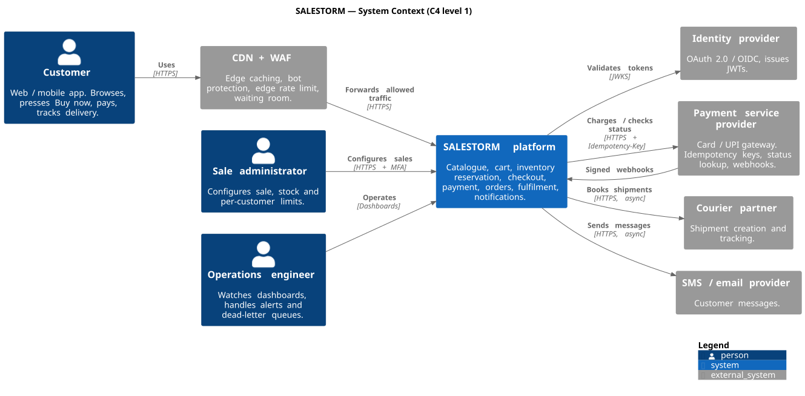
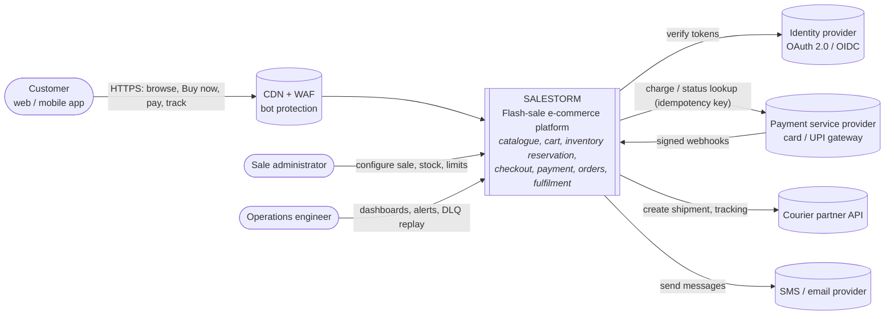

# 02.1 System Context Diagram (C4 level 1)

SALESTORM is one system. Everything around it is a person or an external system it depends on.

PlantUML source: [`uml/01_system_context.puml`](uml/01_system_context.puml) · [PNG](uml/01_system_context.png). The Mermaid version below shows the same diagram as text and renders inline.

| External system | Interaction | Sync / async | Trust |
|---|---|---|---|
| Identity provider | JWT validation (JWKS cached) | Sync, cached | Trusted |
| CDN + WAF | Static content, edge rate limit, bot scoring | Sync | Trusted edge |
| PSP | `charge`, `getStatus`, webhooks | Sync call with timeout + async webhook | Semi-trusted, signature verified |
| Courier partner | Create shipment, tracking callbacks | Async via Fulfilment | Semi-trusted |
| SMS / email | Send notification | Async | Semi-trusted |

**Boundary decision:** card data stays with the PSP (hosted fields / tokens). SALESTORM stores only payment references, which keeps it out of most PCI-DSS scope.
