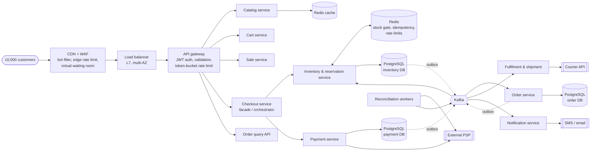

# 02.2 High-Level Design

## 1. Architecture at a glance



## 2. Why each major component exists

| Component | Why it exists | What breaks without it |
|---|---|---|
| CDN + WAF | Serves product pages and assets from the edge; filters bots; first rate limit | Origin melts under 500k req/s of page loads; scalpers bots win |
| Virtual waiting room | Admits users to the buy page at a controlled rate when traffic exceeds capacity | Uncontrolled burst reaches gateway |
| Load balancer | Spreads traffic across gateway pods and zones; health checks | Single point of failure |
| API gateway | One place for auth, validation, per-user/per-IP/global rate limits, routing | Every service re-implements security; no back-pressure |
| Catalog service | Product data; read-heavy, cache-friendly | |
| Cart service | Cart state per customer (Redis-backed) | |
| Sale service | Sale rules: start/end time, per-customer limit, pricing strategy | Rules leak into inventory logic |
| **Checkout service** | Facade that orchestrates the synchronous part: reserve → start payment. Owns no stock or money | Client would call 3 services and handle partial failures |
| **Inventory & reservation service** | Single owner of stock counters and reservation lifecycle. **This is where overselling is prevented** | Stock logic duplicated across services, races |
| Redis stock gate | Atomic in-memory token counter in front of the DB. Rejects ~99 % of requests once sold out without touching the DB | 10,000 requests queue on one DB row |
| **Payment service** | Single owner of payment records, PSP integration, idempotency, reconciliation | Duplicate charges, lost payment results |
| Kafka + transactional outbox | Durable, ordered hand-off between services. Lets Order Service be down without losing paid orders | Payment-succeeded-but-order-lost scenario |
| Order service | Order lifecycle and history | |
| Fulfilment & shipment | Warehouse pick-pack, courier booking, tracking | |
| Notification service | Email/SMS on business events; async so slow providers never slow checkout | |
| Reconciliation workers | Resolve UNKNOWN payments with the PSP, replay DLQ, re-sync Redis gate from DB | Stuck payments, drift |
| Observability stack | Metrics, logs, traces, alerts | Blind during the most critical 5 minutes |

## 3. Synchronous vs asynchronous

| Interaction | Mode | Why |
|---|---|---|
| Buy now → reserve | **Sync** | Customer needs an immediate yes/no. The decision is one DB statement. |
| Pay → PSP charge | **Sync** with 3 s timeout | Customer is waiting on the payment screen; PSP is the source of truth. |
| Payment result → inventory confirm / release | **Async** (event) | Must survive service restarts; idempotent consumer. |
| Payment result → order confirm | **Async** (event) | Order Service outage must not lose or block payments. |
| Order confirmed → fulfilment, notification | **Async** | Slow downstream partners must not slow checkout. |
| Reservation expiry | **Async** (scheduled sweeper) | Time-driven, not request-driven. |
| PSP webhooks | **Async** inbound | Second source of truth for payment results. |

Rule of thumb used in this design: **synchronous only where the customer is waiting for a decision; asynchronous for every consequence of that decision.**

## 4. Where inventory consistency is guaranteed

Exactly one place: the conditional update in the inventory database.

```sql
UPDATE inventory
   SET available_quantity = available_quantity - :qty,
       reserved_quantity  = reserved_quantity  + :qty,
       version = version + 1, updated_at = now()
 WHERE sale_id = :saleId AND product_id = :productId
   AND available_quantity >= :qty;          -- the guard
-- 1 row updated = reserved;  0 rows updated = sold out
```

plus a `CHECK (available_quantity >= 0)` constraint as a second line of defence. The Redis gate in front only reduces load; it can let **more** requests reach the database than there are units, never fewer correct checks. If Redis and the database ever disagree, **the database wins**.

## 5. Bottlenecks and how each is handled

| Likely bottleneck | Why | Mitigation |
|---|---|---|
| Single inventory row (hot row) | Every reservation writes the same row | Redis gate means only ≈ stock + releases (≈ 110) requests reach it; one-statement update holds the lock for microseconds. At larger stock, split into N bucket rows (ADR-002). |
| API gateway CPU | 100k req/s of TLS + JWT | Horizontal autoscale; JWKS cached; edge rate limit first |
| Redis gate single key | ~100k+ ops/s per shard | Sharded token buckets for very large sales; waiting room caps admission |
| PSP rate limits / latency | External | Bounded by stock (≈100 calls); circuit breaker; timeouts |
| Kafka consumer lag during outages | Order Service down | Partitions keyed by reservation id; lag alert; autoscale consumers |
| Product page reads | 500k req/s | CDN + Redis cache-aside; stock badge served from Redis, not DB |
