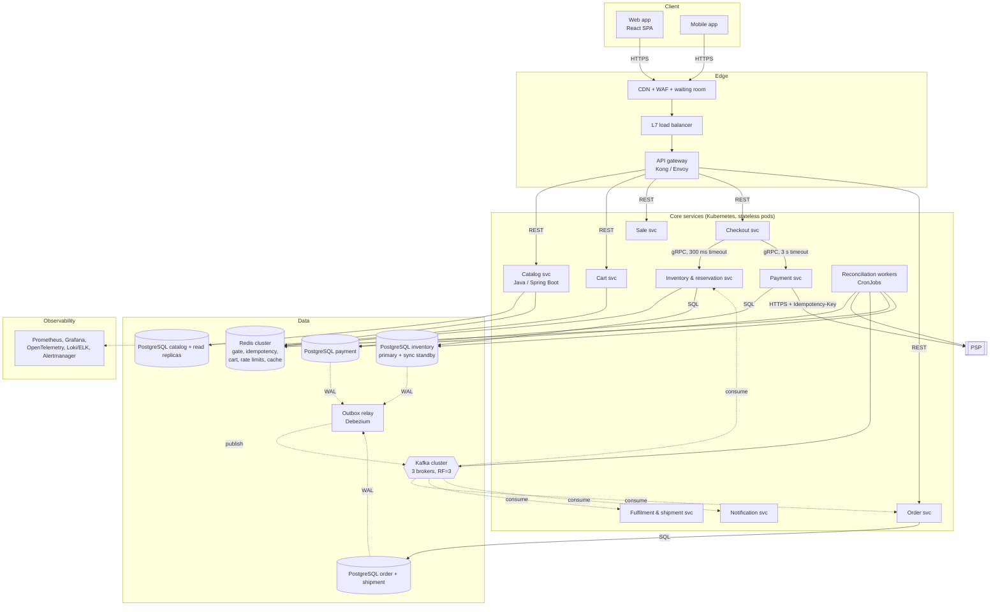

# 02.3 Container Diagram (C4 level 2)

Each box is a separately deployable unit or data store. Arrows show protocol and mode.

| Container | Tech (proposed) | Owns data | Scales by |
|---|---|---|---|
| API gateway | Envoy / Kong | none | pods (HPA on CPU + RPS) |
| Checkout | Spring Boot (prototype: Node.js) | none (stateless orchestrator) | pods |
| Inventory & reservation | Spring Boot | `inventory`, `inventory_reservation`, `outbox` | pods; DB is single writer per SKU |
| Payment | Spring Boot | `payment`, `outbox` | pods |
| Order | Spring Boot | `orders`, `order_item`, `outbox` | pods + Kafka partitions |
| Redis | Redis Cluster 7 | ephemeral: gate tokens, idempotency, carts | shards |
| PostgreSQL | PostgreSQL 16 + Patroni | durable business data | vertical + read replicas; database per service |
| Kafka | Kafka 3.x | event log | partitions |

**Database per service:** no service reads another service's tables. Cross-service data flows through APIs or events, which keeps service boundaries real and lets each database be tuned for its workload.
