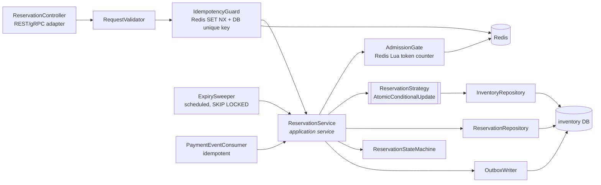
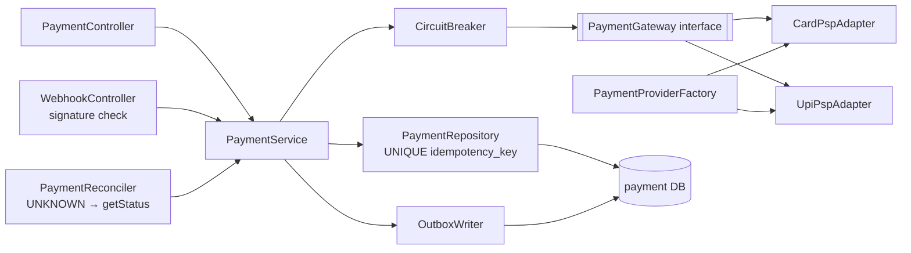
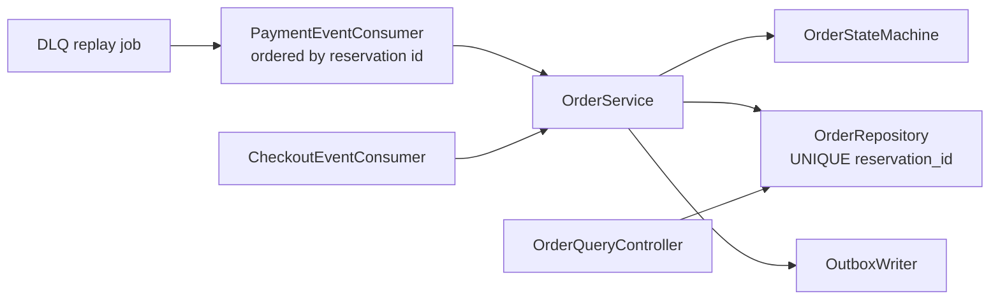
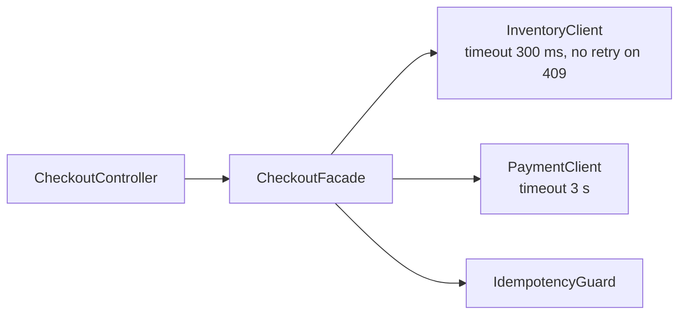

# 02.4 Component Diagrams (C4 level 3) — critical services

## Inventory & reservation service

| Component | Responsibility |
|---|---|
| ReservationController | HTTP/gRPC mapping, status codes, headers. No business logic. |
| RequestValidator | Schema, quantity = 1, sale is live, customer limit. |
| IdempotencyGuard | Same key → same result; concurrent duplicates wait for the first. |
| AdmissionGate | Fast in-memory sold-out answer; load shedding. |
| ReservationStrategy | Concurrency control (Strategy pattern); selected: atomic conditional update. |
| ReservationStateMachine | Legal transitions only (State pattern). |
| OutboxWriter | Writes events in the same DB transaction as state changes. |
| ExpirySweeper | Releases expired RESERVED holds. |
| PaymentEventConsumer | Confirms or releases on PaymentSucceeded / PaymentFailed. |

## Payment service

## Order service

## Checkout service (Facade)

