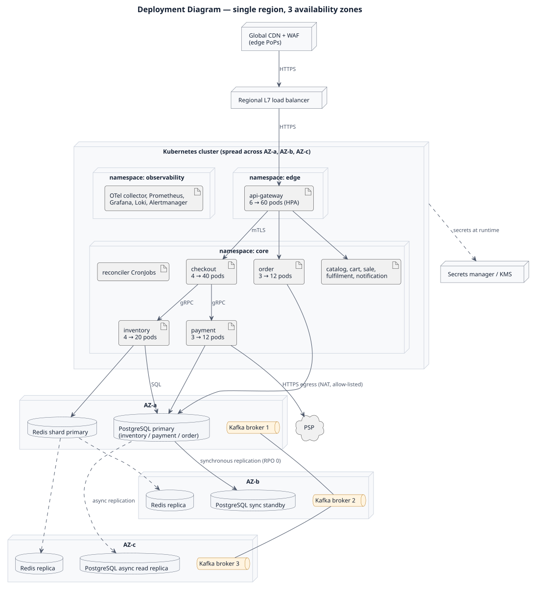
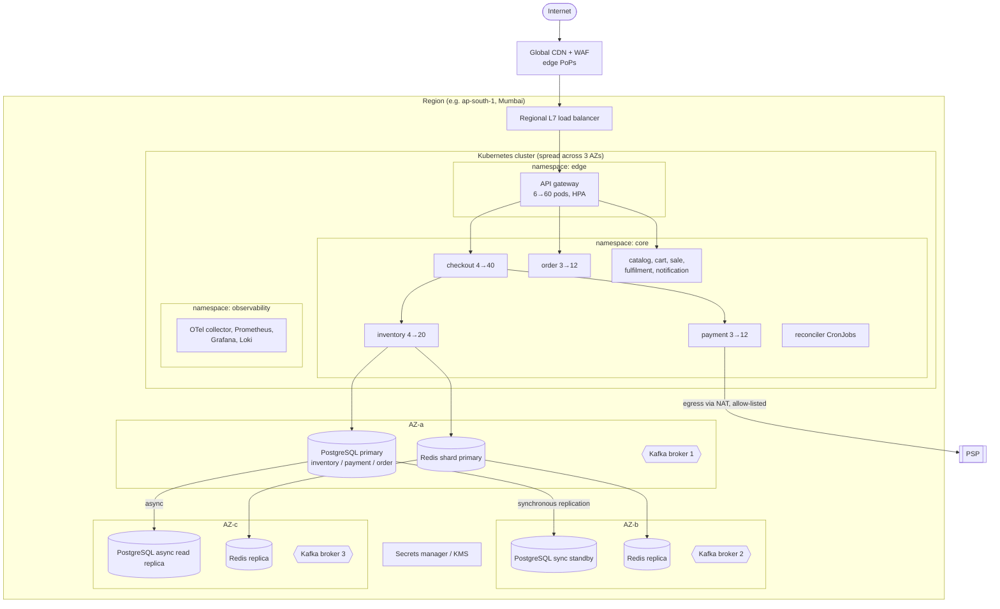

# 02.5 Deployment Diagram

Single cloud region, three availability zones (AZ-a, AZ-b, AZ-c), managed Kubernetes.

PlantUML source: [`uml/05_deployment_diagram.puml`](uml/05_deployment_diagram.puml) · [PNG](uml/05_deployment_diagram.png). The Mermaid version below shows the same diagram as text and renders inline.

| Element | Configuration | Reason |
|---|---|---|
| Pods | `minReplicas` raised 30 min before sale (pre-warming); HPA on CPU + RPS | Autoscaling is too slow for a 5-second burst; scale before, not during |
| PodDisruptionBudget | ≥ 2 pods of each core service always available | Rolling deploys never take capacity away |
| Topology spread | Pods spread across 3 AZs | Survive an AZ loss |
| PostgreSQL | Patroni, synchronous standby in another AZ, failover < 30 s | RPO 0 for stock and money |
| Redis | Cluster, replica per shard, AOF every second | Ephemeral data; gate can be rebuilt from DB |
| Kafka | 3 brokers, replication factor 3, `min.insync.replicas=2`, `acks=all` | No event loss on one broker failure |
| Network | Private subnets; mTLS via service mesh; only gateway is public | Zero-trust between services |
| Secrets | Vault / cloud KMS, injected at runtime, rotated | No secrets in images or Git |
| Deploy freeze | No deploys from T−2 h to T+1 h of a sale | Change is the top cause of incidents |
