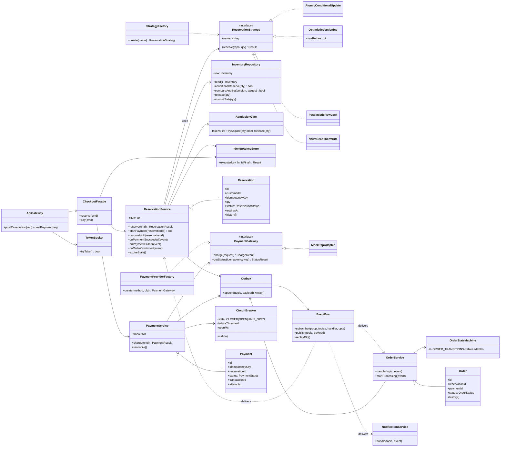

# 03.1 Class Diagram — Inventory, Payment, Order

These classes exist in the prototype (`11_AI_Assisted_Validation/prototype/backend/src`). Names match the code so the jury can open any class.

## Responsibilities and where cross-cutting concerns live

| Concern | Lives in | Not in |
|---|---|---|
| Authentication, rate limiting, input validation | `ApiGateway`, `TokenBucket` | Domain services |
| Idempotency (HTTP) | `IdempotencyStore` used by `ReservationService` and `CheckoutFacade` | Controllers |
| Idempotency (payments) | `PaymentService` (UNIQUE key) + PSP key de-duplication | Checkout |
| Idempotency (events) | Every consumer checks current state before acting (`if status !== PAYMENT_PENDING return`) | Event bus |
| Concurrency control | `ReservationStrategy` implementation, executed by the database | Application memory |
| State legality | `ReservationStateMachine`, `OrderStateMachine` | Scattered `if` statements |
| Error handling for PSP | `CircuitBreaker` + `PaymentService` (UNKNOWN, reconcile) | Customer-facing code |
| Retries for events | `EventBus` consumer group (backoff, DLQ) | Business handlers |
