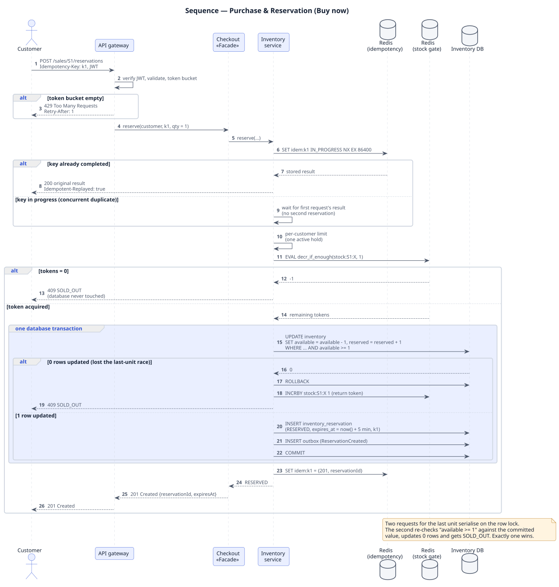
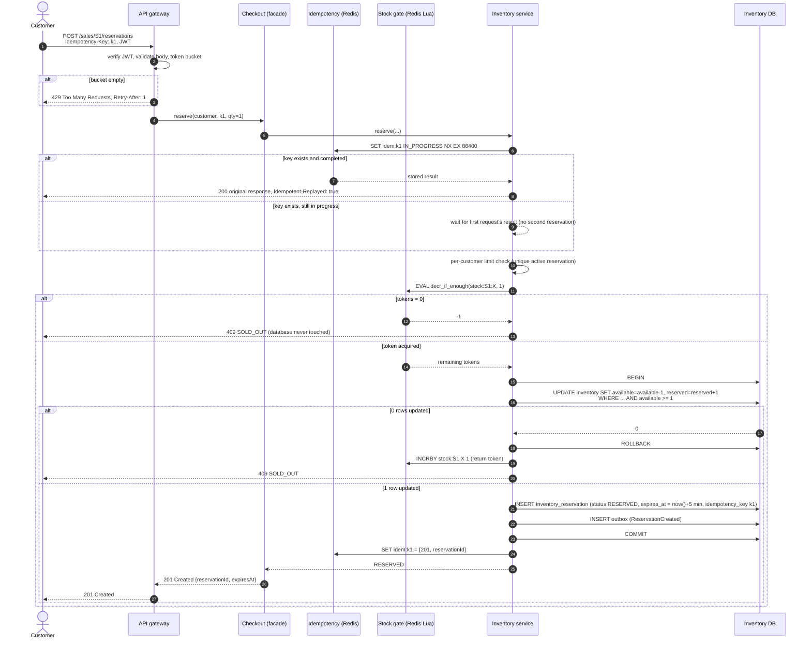

# 03.2 Sequence — Purchase & Reservation

Covers: successful reservation, duplicate request, inventory at zero, last-unit race.

PlantUML source: [`uml/02_sequence_purchase_reservation.puml`](uml/02_sequence_purchase_reservation.puml) · [PNG](uml/02_sequence_purchase_reservation.png). The Mermaid version below shows the same diagram as text and renders inline.

**Transaction boundary:** steps 13–17 are one database transaction. The stock decrement, the reservation row and the outbox event commit together or not at all.

**Last-unit race (two requests, one unit):** both may pass the gate only if it had two tokens; both reach step 13. The database serialises the two `UPDATE` statements on the row lock. The first sees `available = 1` and updates 1 row; the second re-evaluates the guard against the committed value `available = 0` and updates 0 rows. Exactly one wins, deterministically, with no application-level lock. Validated by test `last unit: two simultaneous buyers, exactly one wins` (50 repetitions).
