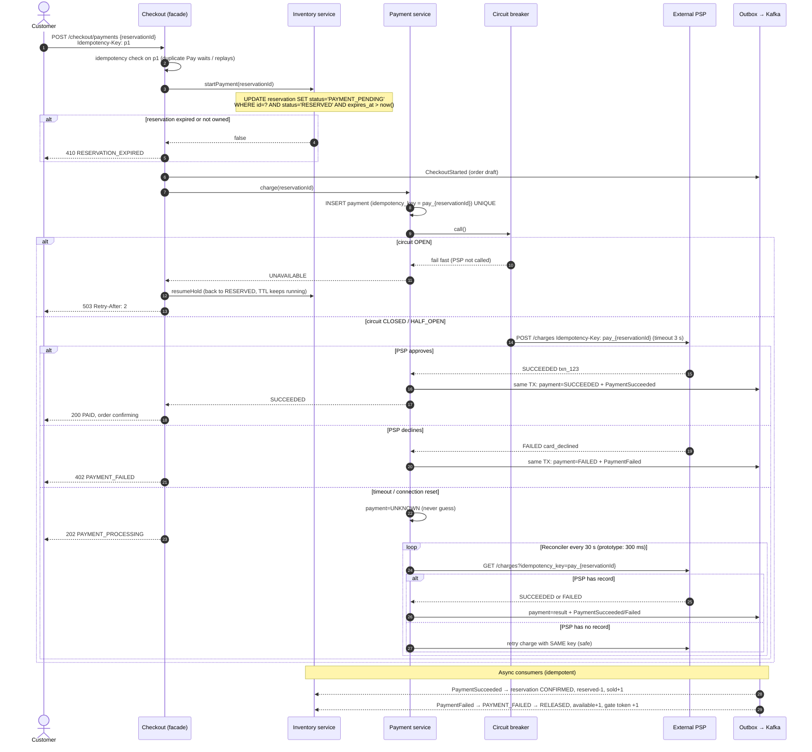

# 03.3 Sequence — Payment (success, failure, timeout, duplicate, gateway down)

| Scenario (Challenge C) | Behaviour | Proven by |
|---|---|---|
| Payment succeeds | Payment + event in one TX; inventory and order follow via events | Trace "Successful purchase" |
| Payment fails | Event releases the unit; order cancelled; customer notified | Test `failed payment releases the unit`; trace "Failed payment" |
| Payment times out | UNKNOWN → reconcile by status lookup → same-key retry if absent | Trace "Payment timeout" (no double charge invariant) |
| Duplicate payment request | Checkout idempotency (p1) + payment UNIQUE key + PSP key = three layers | Test `duplicate Pay requests charge the card once` |
| Payment succeeds, Order fails | See order sequence | Trace "Paid, then Order Service down" |
