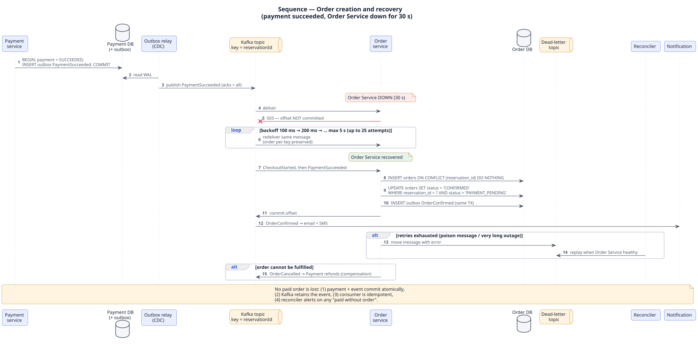

# 03.4 Sequence — Order creation and recovery (payment succeeded, Order Service down)



<sub>PlantUML source: [`uml/04_sequence_order_recovery.puml`](uml/04_sequence_order_recovery.puml) · [PNG](uml/04_sequence_order_recovery.png). The Mermaid version below shows the same diagram as text and renders inline.</sub>

```mermaid
sequenceDiagram
    autonumber
    participant PAY as Payment service
    participant PDB as Payment DB (outbox)
    participant RL as Outbox relay (Debezium)
    participant K as Kafka topic payments<br/>(key = reservationId)
    participant ORD as Order service
    participant ODB as Order DB
    participant DLQ as Dead-letter topic
    participant REC as Reconciler
    participant N as Notification

    PAY->>PDB: BEGIN; UPDATE payment SUCCEEDED; INSERT outbox PaymentSucceeded; COMMIT
    RL->>PDB: read WAL
    RL->>K: publish PaymentSucceeded (acks=all)
    Note over ORD: Order Service DOWN for 30 s
    K-->>ORD: deliver
    ORD--xK: 503 / pod not ready (offset NOT committed)
    loop backoff 100 ms, 200 ms, 400 ms … max 5 s, up to 25 attempts
        K-->>ORD: redeliver same message (ordering per key preserved)
    end
    Note over ORD: Order Service recovers
    K-->>ORD: deliver CheckoutStarted, then PaymentSucceeded
    ORD->>ODB: INSERT orders ON CONFLICT (reservation_id) DO NOTHING
    ORD->>ODB: UPDATE orders SET status='CONFIRMED' WHERE reservation_id=? AND status='PAYMENT_PENDING'
    ORD->>ODB: INSERT outbox OrderConfirmed (same TX)
    ORD->>K: commit offset
    K-->>N: OrderConfirmed → email + SMS
    alt retries exhausted (poison message or long outage)
        ORD->>DLQ: move message with error
        REC->>DLQ: replay when Order Service healthy (alert raised)
    end
    alt order cannot be fulfilled (e.g. reservation invalid)
        ORD->>K: OrderCancelled → Payment service issues refund (compensation)
    end
```

**Why no paid order is ever lost**

1. The payment result and the event are committed **atomically** (transactional outbox). There is no window where money moved but the event does not exist.
2. Kafka keeps the event durably (RF = 3) until the Order Service commits its offset.
3. The consumer is **idempotent**: `UNIQUE(reservation_id)` + state-conditional update make redelivery harmless.
4. Ordering per reservation (partition key) guarantees `CheckoutStarted` is processed before `PaymentSucceeded`.
5. A reconciliation job compares `payment.status = SUCCEEDED` against `orders.status ≥ CONFIRMED` every minute and raises an alert or replays for any gap.

Measured in the prototype (Order Service down 3,000 ms, 10× compressed = 30 s): about 220 events queued, zero lost, all 100 orders confirmed after recovery; worst order confirmation delay ≈ 3.5 s (35 s real-time).
