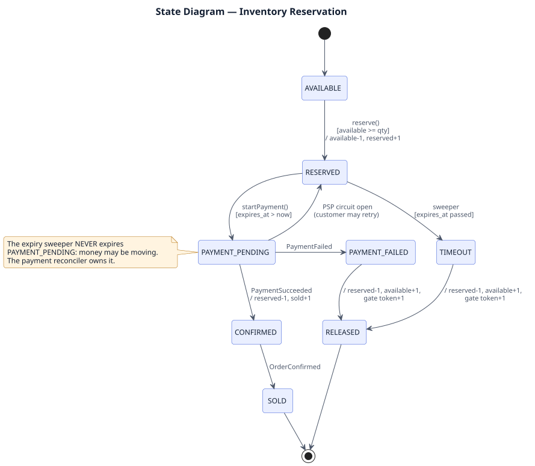
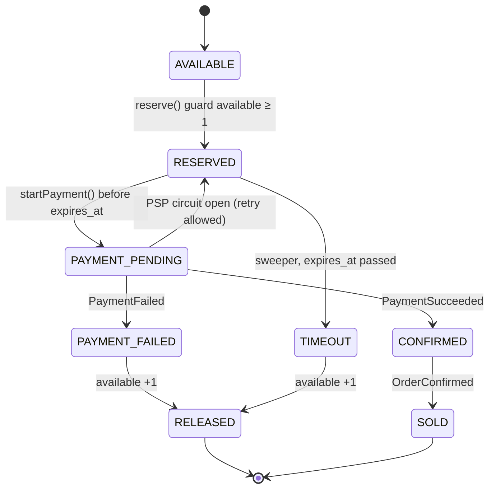
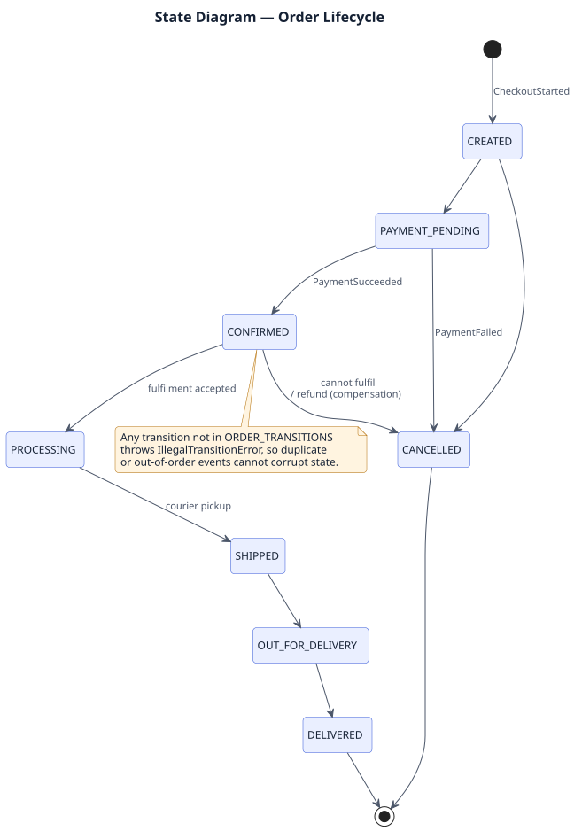
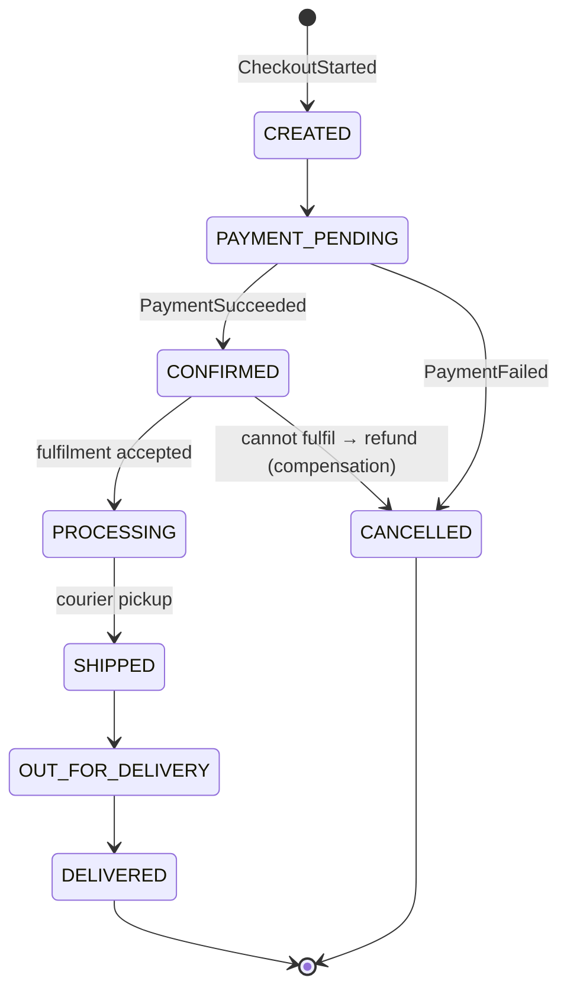

# 03.5 State Diagrams — Reservation and Order

## Reservation lifecycle (Challenge B)

PlantUML source: [`uml/05_state_reservation.puml`](uml/05_state_reservation.puml) · [PNG](uml/05_state_reservation.png). The Mermaid version below shows the same diagram as text and renders inline.

| Transition | Stock counters | Owner |
|---|---|---|
| → RESERVED | available −1, reserved +1 | Inventory (sync) |
| RESERVED → PAYMENT_PENDING | none | Inventory, called by Checkout |
| → CONFIRMED | reserved −1, sold +1 | Inventory (event) |
| → RELEASED | reserved −1, available +1, Redis token +1 | Inventory (event or sweeper) |

**Design rule:** the sweeper expires only `RESERVED`, never `PAYMENT_PENDING`. Once money may be moving, the payment reconciler owns the outcome. This removes the "customer paid one second after expiry" race completely.

## Order lifecycle (Challenge D)

PlantUML source: [`uml/06_state_order.puml`](uml/06_state_order.puml) · [PNG](uml/06_state_order.png). The Mermaid version below shows the same diagram as text and renders inline.

Both machines are implemented as transition tables (`RESERVATION_TRANSITIONS`, `ORDER_TRANSITIONS`). Any transition not in the table throws `IllegalTransitionError`, so an out-of-order or duplicate event can never corrupt state. Every transition is appended to `history` (audit).
