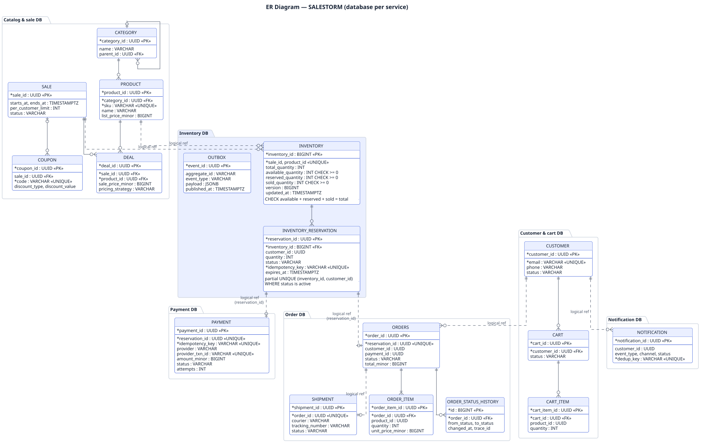
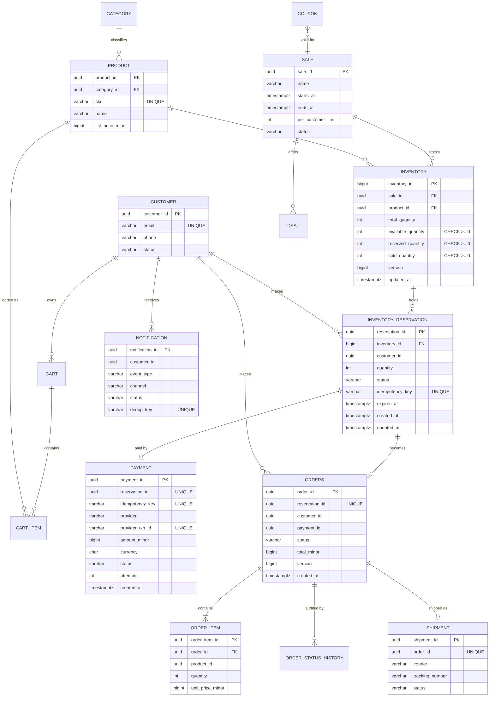

# 04. Database / ER Design

PostgreSQL 16, **database per service**. Tables are grouped by owning service; foreign keys are enforced **inside** a service's database only. Cross-service references (for example `orders.payment_id`) are logical IDs, kept consistent by events and reconciliation. Full DDL: `schema.sql`.

PlantUML source: [`uml/er_diagram.puml`](uml/er_diagram.puml) · [PNG](uml/er_diagram.png). The Mermaid version below shows the same diagram as text and renders inline.

## Keys, constraints and indexes that carry the guarantees

| Guarantee | Enforced by |
|---|---|
| Stock never negative | `CHECK (available_quantity >= 0 AND reserved_quantity >= 0 AND sold_quantity >= 0)` |
| Stock conserved | `CHECK (available_quantity + reserved_quantity + sold_quantity = total_quantity)` |
| No oversell under concurrency | Conditional `UPDATE … WHERE available_quantity >= :qty` (row lock) |
| One reservation per request | `UNIQUE (idempotency_key)` on `inventory_reservation` |
| One active reservation per customer per sale | Partial unique index `ON inventory_reservation (inventory_id, customer_id) WHERE status IN ('RESERVED','PAYMENT_PENDING','CONFIRMED')` |
| One payment per reservation | `UNIQUE (reservation_id)` and `UNIQUE (idempotency_key)` on `payment` |
| One order per reservation | `UNIQUE (reservation_id)` on `orders` |
| One notification per event | `UNIQUE (dedup_key)` = event id + channel |
| Valid states only | `CHECK (status IN (...))` + application state machine |

| Index | Serves |
|---|---|
| `inventory (sale_id, product_id)` UNIQUE | Reservation hot path lookup |
| `inventory_reservation (status, expires_at) WHERE status='RESERVED'` | Expiry sweeper (`FOR UPDATE SKIP LOCKED`) |
| `payment (status, updated_at) WHERE status='UNKNOWN'` | Reconciler |
| `orders (customer_id, created_at DESC)` | "My orders" |
| `outbox (created_at) WHERE published_at IS NULL` | Outbox relay (if polling instead of CDC) |

## Transaction boundaries

| Transaction | Statements (one commit) | Isolation |
|---|---|---|
| Reserve | conditional UPDATE inventory; INSERT reservation; INSERT outbox | READ COMMITTED (row lock + guard re-check is enough) |
| Start payment | conditional UPDATE reservation status | READ COMMITTED |
| Payment result | UPDATE payment; INSERT outbox | READ COMMITTED |
| Confirm reservation | conditional UPDATE reservation; UPDATE inventory reserved→sold | READ COMMITTED |
| Expire | SELECT … FOR UPDATE SKIP LOCKED; UPDATE reservation; UPDATE inventory | READ COMMITTED |
| Order confirm | INSERT … ON CONFLICT DO NOTHING; conditional UPDATE orders; INSERT outbox; INSERT order_status_history | READ COMMITTED |

**Why READ COMMITTED is enough:** in PostgreSQL, a concurrent `UPDATE` that waits on a row lock re-evaluates its `WHERE` clause against the newly committed row version. The guard `available_quantity >= :qty` is therefore checked against the latest value, which is exactly the property we need. SERIALIZABLE would also be correct but adds abort-and-retry overhead on the hottest row.

**No distributed transactions.** Each transaction touches one service's database. Cross-service consistency comes from outbox events, idempotent consumers and reconciliation (saga with compensation: refund if an order cannot be fulfilled).

## Audit information

Every table carries `created_at`, `updated_at`. State changes are appended to `*_status_history` tables (who/what/when/from/to/trace_id). Payments additionally store raw PSP response references for dispute handling.
